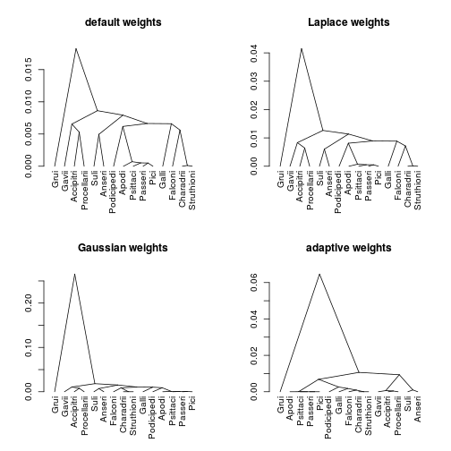
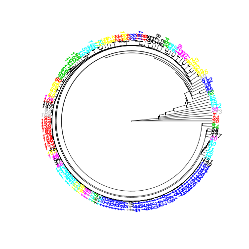
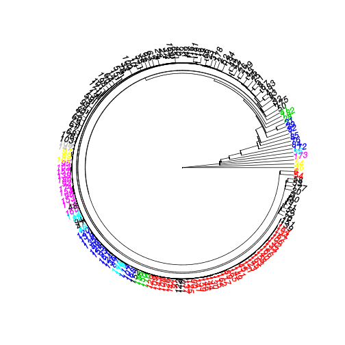

# Fused-ANOVA: a package to fit weighted fusion poenalties at large scale

_This README is preliminary, more to come soon, simultaneously with a fresh-up of the package..._

## Description

Fused-ANOVA is a penalized method that solves the one-way ANOVA problem by collapsing the coefficients of K conditions. It reconstructs a balanced tree structure between the condition with a homotopy algorithm.

For a large class of weights implemented here, our homotopy algorithm is in $\mathcal{O}(K log(K))$.  These weights induce a balanced tree structure and simplify the interpretation of the results. The package contains an illustrating phenotypic data set:
 given a trait, we reconstruct a balanced tree structure and assess  its agreement with the known phylogeny.

### Problem solved:

The optimization problem solved by fused-ANOVA is 
\[
  \hat{\beta}_{\lambda} = \arg \min_{\beta} \left\{\sum_{k=1}^K \sum_{i=1}^{n_k} \left(Y_{ik}-\beta_k \right)^2
 + \lambda \sum_{k,\ell} w_{k\ell} \left|\beta_k - \beta_\ell \right|\right\}}}
\]
where $Y_{ik}}{Y_ik}$ is the intensity of a continuous random variable for sample $i$ in condition $k$ and $\beta_k$ is the mean parameter of condition $k$. We denote by $K$ the total number of conditions and $n_k$ the number of sample in each condition.

### Choice of weights and performance of the algorithm:

We propose various weights in the fused-penalty (entailing "laplace", "gaussian", "adaptive" - see the corresponding documentation) for which the homotopy algorithm produces a path that contains no split, which is highly desirable since in this case
  - the order of the \eqn{\beta_k}{beta_k} always matches the order of the empirical mean of each condition;
  - the recovered structure is a tree which simplifies the interpretation;
  - the total number of iterations is guaranteed to be small and equal to \eqn{K}{K};
  - we avoid maximum flow problems whose resolution is  computationally demanding.

Letting $\bar{y}_k = \sum_{i=1}^{n_k} y_{ik} / n_k$ be the initial means in group $k$ (also equal to $\beta_k^0$), we define the three set of weights as follows:
\begin{equation*}
\begin{aligned}
w_{k\ell}^{\text{laplace}}  & = n_k n_\ell \exp\{-\gamma |\bar{y}_k - \bar{y}_\ell| \} \\K
w_{k\ell}^{\text{Gaussian}} & = n_k n_\ell \exp\{-\gamma (\bar{y}_k - \bar{y}_\ell) ^2 \} \\
w_{k\ell}^{\text{adaptive}} & = \frac{n_k n_\ell}{|\bar{y}_k - \bar{y}_\ell|^\gamma}  \\
\end{aligned}
\end{equation*}

For the "laplace" weight, the associated algorithm is in $\mathcal{O}(K\log(K))}{O(klog(K))$ thanks to a recursion property allowing the computation of the K^2 weights in only $K$ opeartions.

<!-- ### Efficient cross-validation procedure: -->

<!-- We provide a fast cross validation (CV) procedure to select $\lambda$ for both the general and the no split algorithms.  The idea behind this procedure is to take advantage of the DAG structure of the path of solutions along $\lambda$. Rather than computing the CV error for each condition separately, we traverse each edge of the DAG once and only once and compute simultaneously the error of all conditions going through this edge.  If we consider a perfectly balanced tree and a grid of $P$ values of -->
<!-- $\lambda we achieve $\mathcal{O}(P \log (P))$ rather than a $\mathcal{O}(P^2)$ complexity. -->

### Technical remarks:

Most of the numerical work is done in \code{C++}, relying on the **Rcpp** package. 

### references

Chiquet J, Gutierrez P, Rigaill G: _Fast tree inference with weighted fusion penalties_, **Journal of Computational and Graphical Statistics** 205–216, 2017. [PDF version](http://www.tandfonline.com/doi/abs/10.1080/10618600.2015.1096789?journalCode=ucgs20)

T. Hocking, J.-P. Vert, F. Bach, and A. Joulin. _Clusterpath: an Algorithm for Clustering using Convex Fusion Penalties_, ICML, 2011.

## Installation


```r
devtools::install_github("jchiquet/fusedanova").
```

## Example: reconstruction of bird phylogeny from their weights

This **aves** data set gives the birth weight of for 40 bird families classified in 15 orders and regrouping a total of 184 individuals. It comes from [An Age: The Animal Ageing and Longevity Database](http://genomics.senescence.info/species/).

The corresponding data frame contains 184 rows with three columns: "weight" (the weight in grammes), "family" (a factor with 40 levels) and "order" (a factor with 15 levels):

```r
library(fusedanova)
data(aves)
head(aves)
```

```
##   weight     order       family
## 1  110.6 Accipitri Accipitridae
## 2   39.4 Accipitri Accipitridae
## 3   23.8 Accipitri Accipitridae
## 4   29.3 Accipitri Accipitridae
## 5   60.0 Accipitri  Cathartidae
## 6   70.0 Accipitri  Cathartidae
```

By default, $\gamma = 0$  and so all weights reduce to $n_k n_\ell$ and are just equivalent.


```r
fa.default <- fusedanova(aves$weight, aves$order, standardize=TRUE)
```

If not specify, the weighting scheme is Laplace. As can be seen, using a positive $\gamma$ tends to fused quicker the groups which were closer at the start-up of the path.


```r
fa.laplace <- fusedanova(aves$weight, aves$order, gamma=.25, standardize=TRUE)
```

Gaussian weights provide a nice interpretation but do not guarante low complexity.


```r
fa.gaussian <- fusedanova(aves$weight, aves$order, "gaussian", gamma=sqrt(.1), standardize=TRUE)
```

The adaptive-weigths correspond to the Cas-ANOVA approach by Bondel and Reich, that do not enjoy a low computational complexity but the same kind of statistical guarantees as the lapace weights.


```r
fa.adaptive <- fusedanova(aves$weight, aves$order, "adaptive", gamma=exp(.1), standardize=TRUE)
```

### Plotting dendrogram

Slot 'hc' of a fusedanova object is an "hclust" object, so you can rely on the available methods for this kind of object:


```r
par(mfrow=c(2,2))
plot(as.dendrogram(fa.default$hc ), type="triangle", main="default weights")
plot(as.dendrogram(fa.laplace$hc ), type="triangle", main="Laplace weights")
plot(as.dendrogram(fa.gaussian$hc), type="triangle", main="Gaussian weights")
plot(as.dendrogram(fa.adaptive$hc), type="triangle", main="adaptive weights")
```



```r
cutree(fa.adaptive$hc, c(2, 6))
```

```
##             2 6
## Apodi       1 1
## Pici        1 1
## Passeri     1 1
## Psittaci    1 1
## Podicipedi  1 2
## Galli       1 3
## Falconi     1 3
## Struthioni  1 3
## Charadrii   1 3
## Anseri      1 4
## Suli        1 4
## Procellarii 1 5
## Accipitri   1 5
## Gavii       1 5
## Grui        2 6
```

Package **ape** provides more method for plotting dendrogram in a phylogenetic perpective :


```r
library(ape)
fa <- fusedanova(aves$weight, gamma=0.25, standardize=TRUE)
plot(as.phylo(fa$hc), type="fan", tip.color=as.numeric(aves$family))
```



```r
plot(as.phylo(fa$hc), type="fan", tip.color=as.numeric(aves$order))
```




